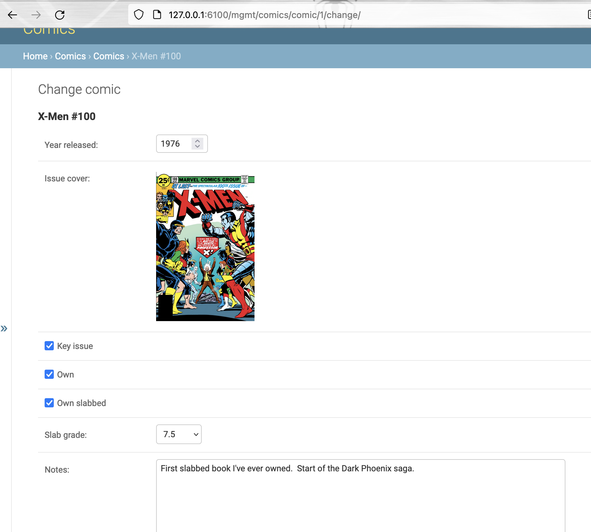

# Comics Project

I collect comics.  I want to be able to track which ones I own. Hence, this
Django app.

## Screenshot



## Updating dependencies

Install pip-tools.

Run:

```shell
pip-compile --generate-hashes --upgrade --output-file=requirements.txt requirements.in
python -m pip install --upgrade pip && python -m pip install --upgrade -r requirements.txt && python -m pip install --upgrade -r requirements-dev.txt
```
